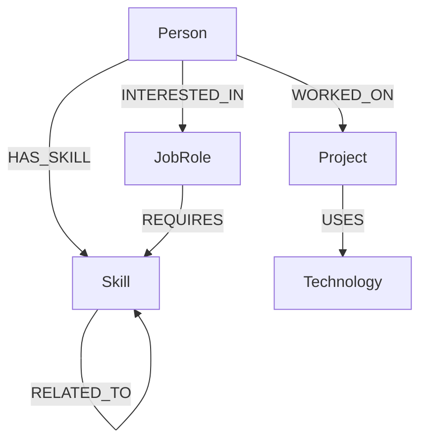

# SkillGraph

**Skill & Career Relationship Explorer** — a full-stack graph application built for the Wexa AI Software Engineer (Full-Stack / Web) take-home assignment.

SkillGraph lets you explore how **people**, **skills**, **projects**, **technologies** and **job roles** connect to one another — who knows what, which projects used which stack, which roles are within reach, and which skill to learn next.

## Demo

Hosted demo: _add your deployed URL here once you deploy (e.g. Render)._

## Why a Graph Database?

Most of what SkillGraph does is really a set of **many-to-many relationships that chain together**: a person has many skills, a skill is required by many roles, a project uses many technologies, and skills relate to other skills. In a relational database, answering a question like *"which job roles is this person closest to, and what's missing?"* means joining Person → PersonSkill → Skill → RoleSkill → JobRole, then grouping and comparing two sets of skill IDs in application code — several joins and a fair amount of manual set logic for one feature.

In a graph database, the same question is a **traversal**:

```
(Person)-[:HAS_SKILL]->(Skill)<-[:REQUIRES]-(JobRole)
```

Walk outward from the person, walk backward from every role, and compare what you land on. The relationships *are* the data structure, so multi-hop questions like "skills related to skills I already have" or "technologies used by projects I worked on" are natural one-line Cypher patterns instead of cascading joins.

Concrete example from this app: the **Career Path Explorer** compares a person's current skills against every job role's required skills to compute a match percentage, matched skills and missing skills — a single Cypher query (see `get_career` in `app.py`) instead of a multi-table join-and-aggregate pipeline.

## Architecture

```
Browser (HTML/CSS/JS, Cytoscape.js)
        |
        v
   Flask (app.py)
        |
        v
Neo4j Python Driver (Bolt protocol)
        |
        v
     CognoDB
        |
        v
   Property Graph
```

Everything — Flask routes, the Neo4j driver setup, Cypher queries, seed data, and the embedded HTML/CSS/JS front end — lives in a single file, `app.py`, by design (see Project Structure below).

## Data Model

Node labels: `Person`, `Skill`, `Project`, `Technology`, `JobRole`



## Features

- **Dashboard** — live counts of people, skills, projects, technologies and job roles, plus an interactive graph overview and career insights.
- **People Explorer** — searchable list of people; click into a person to see their skills, projects, technologies (via projects), recommended job roles and missing skills.
- **Skill Explorer** — browse and filter skills by name/category; see who has a skill, which projects use it, related skills, and which roles require it.
- **Project Explorer** — browse projects; see technologies used and people involved.
- **Career Explorer** — pick any person and see their current skills, ranked job-role matches with a progress bar per role, and graph-derived "recommended next skills."
- **Graph Explorer** — pick any node (person, skill, project, technology, or job role) and visually explore everything connected to it with Cytoscape.js; click any node to highlight its neighborhood and open an info panel.
- Loading states, empty states and friendly error states throughout.
- Fully responsive layout (desktop, tablet, mobile).

## Main Cypher Queries

**Multi-hop traversal — technologies used across a person's projects:**
```cypher
MATCH (p:Person {id: $id})-[:WORKED_ON]->(:Project)-[:USES]->(t:Technology)
RETURN DISTINCT t ORDER BY t.name
```

**Career matching (the graph-specific query):**
```cypher
MATCH (r:JobRole)-[:REQUIRES]->(rs:Skill)
RETURN r, collect(rs) AS required
```
The app then compares each role's required-skill set against the person's `HAS_SKILL` set to compute matched/missing skills and a match percentage.

**Multi-hop skill recommendation:**
```cypher
MATCH (p:Person {id: $id})-[:HAS_SKILL]->(s:Skill)-[:RELATED_TO]->(rel:Skill)
WHERE NOT (p)-[:HAS_SKILL]->(rel)
RETURN rel, collect(DISTINCT s.name) AS becauseOf
```

**Graph exploration (any node → its neighborhood):**
```cypher
MATCH (n:Skill {id: $id})
OPTIONAL MATCH (n)-[r]-(m)
RETURN n, labels(n), r, type(r), m, labels(m)
```

All queries are parameterized (`$id`, `$q`, etc.) — no string concatenation of user input into Cypher, anywhere.

## Setup

1. **Clone the repository**
   ```bash
   git clone <your-repo-url>
   cd skillgraph
   ```

2. **Create a Python virtual environment**
   ```bash
   python -m venv venv
   ```

3. **Activate it**

   Windows:
   ```bash
   venv\Scripts\activate
   ```
   macOS/Linux:
   ```bash
   source venv/bin/activate
   ```

4. **Install dependencies**
   ```bash
   pip install -r requirements.txt
   ```

5. **Create a CognoDB account** at your CognoDB provider's dashboard.

6. **Create a free instance** and wait for it to become available.

7. **Copy the Bolt connection URI** (something like `bolt+s://xxxxxxxx.databases.cognodb.cloud`).

8. **Save the generated password** shown when the instance is created — it's usually shown only once.

9. **Create your `.env` file**
   ```bash
   cp .env.example .env
   ```
   Then fill in `COGNODB_URI`, `COGNODB_USERNAME` and `COGNODB_PASSWORD`.

10. **Seed the database**
    ```bash
    python app.py --seed
    ```

11. **Start the application**
    ```bash
    python app.py
    ```

Visit `http://localhost:5000` in your browser.

## Environment Variables

| Variable | Description |
|---|---|
| `COGNODB_URI` | Bolt connection URI for your CognoDB instance, e.g. `bolt+s://your-instance.databases.cognodb.cloud` |
| `COGNODB_USERNAME` | Database username |
| `COGNODB_PASSWORD` | Database password |
| `PORT` | (optional) Port for the Flask server, defaults to `5000` |

## Screenshots

Add screenshots to a `screenshots/` folder and reference them here once you've run the app locally:

- `screenshots/dashboard.png` — Dashboard with stats and graph overview
- `screenshots/graph-explorer.png` — Graph Explorer with a node's neighborhood highlighted
- `screenshots/career-explorer.png` — Career Explorer with match percentages
- `screenshots/person-detail.png` — Person detail panel

## Deployment

To deploy on a free host such as **Render**:

1. Push this repository to GitHub.
2. On Render, create a new **Web Service** and connect your GitHub repo.
3. Build command: `pip install -r requirements.txt`
4. Start command: `python app.py`
5. Under **Environment**, add `COGNODB_URI`, `COGNODB_USERNAME`, `COGNODB_PASSWORD` (and optionally `PORT`, though Render sets this automatically).
6. Deploy, then run the seed step once — either via a Render **Shell** (`python app.py --seed`) or a one-off job — before demoing.

Don't list a demo URL above until the app is actually deployed and reachable.

## Interview Talking Points

**Why I chose this problem.** It's a small, self-contained domain (people/skills/projects/roles) that still has genuinely many-to-many, multi-hop relationships — a good showcase for *why* a graph database is the right tool, not just *that* I can use one.

**Why a graph database.** The interesting questions in this domain ("what role is this person closest to," "what should they learn next," "who else knows what I know") are naturally graph traversals. Modeling them relationally works, but needs several joins per question; modeling them as a graph makes the traversal explicit and readable.

**Why CognoDB.** It speaks the openCypher dialect over the Bolt protocol and is compatible with the official Neo4j drivers, so I get a managed graph database without writing a custom client.

**Why Flask.** Lightweight, minimal boilerplate, and lets the whole app — routes, queries, and the embedded front end — live in one readable file, which fit the assignment's "single `app.py`" constraint well.

**Why the official Neo4j driver.** It's the supported, battle-tested way to talk Bolt/Cypher from Python, handles connection pooling and sessions for me, and is what CognoDB explicitly supports.

**How the graph model works.** Five node labels (`Person`, `Skill`, `Project`, `Technology`, `JobRole`) connected by six relationship types (`HAS_SKILL`, `WORKED_ON`, `USES`, `RELATED_TO`, `REQUIRES`, `INTERESTED_IN`). Every relationship is intentionally directional and named for what it represents.

**How multi-hop queries work.** Cypher lets you chain relationship patterns in one `MATCH`, e.g. `(p:Person)-[:WORKED_ON]->(:Project)-[:USES]->(t:Technology)` walks two hops to find all technologies a person has touched through their project work, without an explicit join table.

**How career matching works.** For a given person, I collect their `HAS_SKILL` skill IDs into a set, then for every `JobRole` I collect its `REQUIRES` skill nodes and compare the two sets to get matched skills, missing skills, and `matched / required * 100` as a percentage.

**How parameterized queries prevent injection.** Every user-controlled value (search text, IDs from the URL) is passed as a named Cypher parameter (e.g. `$id`, `$q`) instead of being string-formatted into the query text, so user input is always treated as data, never as part of the query structure.

**How errors are handled.** Every route is wrapped so a lost database connection raises a specific `DatabaseUnavailable` exception, which becomes a friendly "please try again later" JSON message and a 503 status — never a raw stack trace to the browser. Unexpected exceptions are logged server-side and also turned into a generic friendly error.

**How secrets are protected.** Credentials only ever come from environment variables (`.env`, loaded via `python-dotenv`), are never sent to the browser, and `.env` is git-ignored so it can't be committed by accident.

**What I'd improve in production.** Add authentication/authorization, pagination for large result sets, caching for the dashboard stats and graph overview, automated tests around the Cypher queries, and a proper migration/versioning strategy for the seed data instead of a one-shot script.
